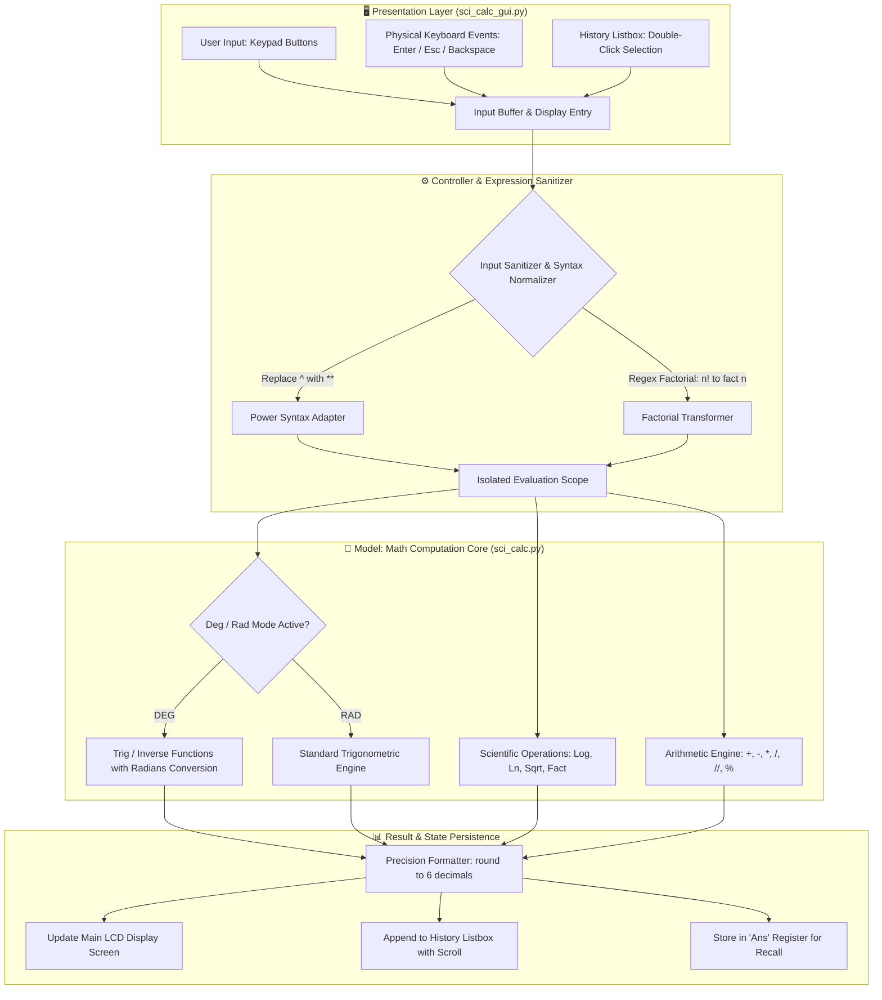

# 🧮 Advanced Scientific Calculator (AdvSciCalcGUI)

[](https://www.python.org/downloads/)
[](https://docs.python.org/3/library/tkinter.html)
[](sci_calc.py)
[](https://pyinstaller.org/)
[](test_sci_calc.py)
[](LICENSE)

> A modern, dark-themed graphical scientific calculator desktop application built with Python and Tkinter. Features an expression evaluation display, interactive scientific keypad, real-time calculation history with double-click recall, DEG/RAD angle switching, and a decoupled, fully unit-tested mathematical computation engine.

---

## 📑 Table of Contents
- [Architecture & Data Flow](#-architecture--data-flow)
- [Key Features](#-key-features)
- [Mathematical Functionalities](#-mathematical-functionalities)
- [Keyboard Shortcuts](#-keyboard-shortcuts)
- [Repository Structure](#-repository-structure)
- [Getting Started](#-getting-started)
- [Standalone Packaging (.exe)](#-standalone-packaging-with-pyinstaller)
- [Testing & Quality Assurance](#-testing--quality-assurance)
- [Author & Connect](#-author)
- [License](#-license)

---

## 🏛️ Architecture & Data Flow

AdvSciCalcGUI is architected using a decoupled **Model-View-Controller (MVC)** pattern:
- **View (`sci_calc_gui.py`)**: Handles the Dracula-themed Tkinter layout, key bindings, dynamic history pane, and LCD display.
- **Model / Engine (`sci_calc.py`)**: Pure mathematical engine containing error-guarded arithmetic, trigonometry, hyperbolic, and logarithmic operations.
- **Controller / Dispatcher**: Sanitizes inputs, transforms algebraic symbols (e.g. `^` to `**`, trailing `!` to `fact()`), and safely evaluates expressions inside an isolated execution environment.



---

## ✨ Key Features

- **Dracula Dark Theme**: Ergonomic, high-contrast dark aesthetic (`#1e1e2e` palette) designed for prolonged calculation sessions with minimal eye strain.
- **Dual-Mode Operation**:
  - **Graphical Desktop UI (`sci_calc_gui.py`)**: Full interactive scientific calculator with visual history and responsive grid.
  - **Interactive CLI (`sci_calc.py`)**: Terminal-based menu-driven calculator and reusable Python library.
- **DEG / RAD Angle Toggle**: One-click switching between Degrees and Radians for trigonometric evaluations.
- **Dynamic History Buffer**: Real-time log of all calculated expressions and results with double-click recall and single-click history clear.
- **Ans Memory Recall**: Stores the most recent valid evaluation for immediate use in chained equations.
- **Safe Expression Evaluation**: Clean execution environment restricting global scope (`{"__builtins__": None}`) to prevent arbitrary code execution.
- **Full Unit Test Coverage**: Comprehensive test suite (`test_sci_calc.py`) covering arithmetic boundaries, edge cases, zero-division, and negative roots.

---

## 🧮 Mathematical Functionalities

| Category | Functions / Operations | Description & Syntax |
| :--- | :--- | :--- |
| **Basic Arithmetic** | `+`, `-`, `*`, `/`, `//`, `%` | Addition, Subtraction, Multiplication, Floating Division, Floor Division, Modulus |
| **Powers & Roots** | `^`, `x²`, `sqrt()` | Exponentiation (`2^8`), Squares (`x²`), and Square Roots (`sqrt(144)`) |
| **Logarithms** | `log()`, `ln()`, `exp()` | Base-10 Logarithm (`log(100)`), Natural Logarithm (`ln(e)`), Exponential ($e^x$) |
| **Trigonometry** | `sin`, `cos`, `tan`, `sec`, `cosec`, `cot` | Standard trigonometric ratios supporting Degree and Radian modes |
| **Inverse Trig** | `asin`, `acos`, `atan` | Arc-sine, Arc-cosine, and Arc-tangent functions |
| **Discrete & Combinatorics** | `!` (`fact()`) | Factorial calculations with integer type validation (`5! = 120`) |
| **Mathematical Constants** | $\pi$ (`pi`), $e$ (`e`) | High-precision IEEE floating-point constants |

---

## ⌨️ Keyboard Shortcuts

The desktop GUI is built for speed and supports both mouse-driven clicking and physical keyboard input:

| Key Binding | Action | Description |
| :--- | :--- | :--- |
| <kbd>Enter</kbd> / <kbd>Return</kbd> | **Evaluate Expression** | Evaluates the current formula on screen and records result |
| <kbd>BackSpace</kbd> | **Delete Previous Character** | Removes the character immediately preceding the cursor |
| <kbd>Escape</kbd> | **All Clear (AC)** | Clears the active expression line back to default `0` |
| <kbd>0</kbd> – <kbd>9</kbd> | **Digit Input** | Direct insertion of numeric operands |
| <kbd>+</kbd>, <kbd>-</kbd>, <kbd>*</kbd>, <kbd>/</kbd>, <kbd>%</kbd> | **Operators** | Direct arithmetic operator entry |
| <kbd>(</kbd> and <kbd>)</kbd> | **Parentheses** | Enforces grouping and order of operations |

---

## 📁 Repository Structure

```text
AdvSciCalcGUI/
├── sci_calc.py            # Core mathematical calculation engine & interactive CLI
├── sci_calc_gui.py        # Graphical user interface application (Tkinter)
├── test_sci_calc.py       # Automated unit test suite (Python unittest)
├── calculator.ico         # Custom high-resolution Windows application icon
├── .github/               # GitHub workflows and project templates
└── README.md              # Project documentation
```

---

## 🚀 Getting Started

### Prerequisites
- **Python 3.8+** installed on your system.
- Standard Python library (Tkinter is included by default with official Python installers on Windows and macOS).

> On Linux (Debian/Ubuntu), install Tkinter via:
> ```bash
> sudo apt-get install python3-tk
> ```

### 1. Clone the Repository
```bash
git clone https://github.com/ranjithbrs/AdvSciCalcGUI.git
cd AdvSciCalcGUI
```

### 2. Run the Graphical Calculator (GUI)
```bash
python sci_calc_gui.py
```

### 3. Run the Command-Line Interface (CLI)
```bash
python sci_calc.py
```

---

## 📦 Standalone Packaging with PyInstaller

You can package the calculator into a standalone, portable Windows executable (`.exe`) that runs on any PC without requiring Python to be installed:

```bash
# 1. Install PyInstaller
pip install pyinstaller

# 2. Build standalone executable
pyinstaller --onefile --noconsole --icon=calculator.ico --name="AdvSciCalc" sci_calc_gui.py
```

The compiled binary will be located in the `dist/` directory:
```text
dist/
└── AdvSciCalc.exe
```

---

## 🧪 Testing & Quality Assurance

The core mathematical engine is tested with Python's built-in `unittest` framework covering nominal values, edge cases, domain restrictions, and error conditions.

Run the test suite:
```bash
python -m unittest test_sci_calc.py -v
```

### Test Coverage Summary:
- ✅ **Arithmetic Operations**: Addition, subtraction, multiplication, safe division by zero handling.
- ✅ **Powers & Exponents**: Integer powers, fractional exponents, zero/negative bases.
- ✅ **Square Roots**: Perfect squares, irrational numbers, negative number domain error handling.
- ✅ **Logarithmic Functions**: Base-10 and natural log boundary conditions ($x \le 0$).
- ✅ **Trigonometric Ratios**: Exact values ($0^\circ, 30^\circ, 45^\circ, 90^\circ$) across Degree and Radian modes.
- ✅ **Factorials**: Zero factorial ($0! = 1$), positive integers, negative/fractional input prevention.

---

## 👨‍💻 Author

**Ranjith B**  
🎓 *B.Tech Computer Science & Business Systems (CSBS)*  
🏛️ *Nehru Institute of Engineering and Technology, Coimbatore*  

- 💼 **LinkedIn**: [linkedin.com/in/ranjith-b-85907831a](https://linkedin.com/in/ranjith-b-85907831a)  
- 🐙 **GitHub**: [github.com/ranjithbrs](https://github.com/ranjithbrs)  
- 🌐 **Portfolio**: [ranjithbrs.github.io/portfolio](https://ranjithbrs.github.io/portfolio/)  
- 📧 **Email**: ranjithb2k06@gmail.com  

---

## 📄 License

This project is open source and available under the [MIT License](LICENSE).
